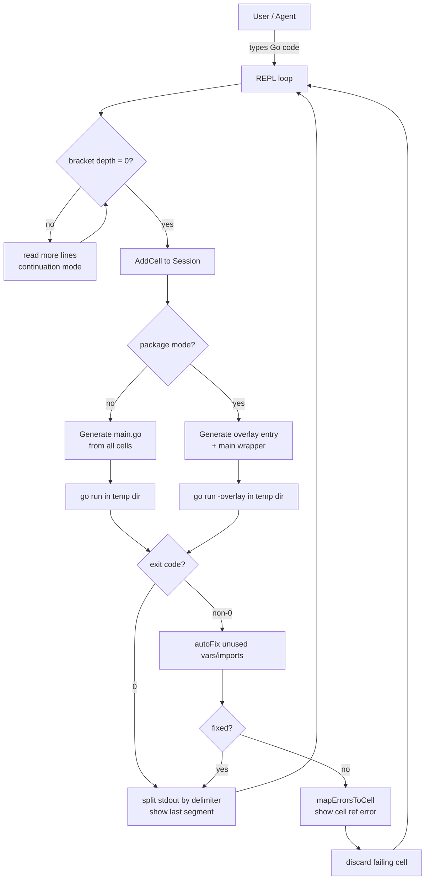
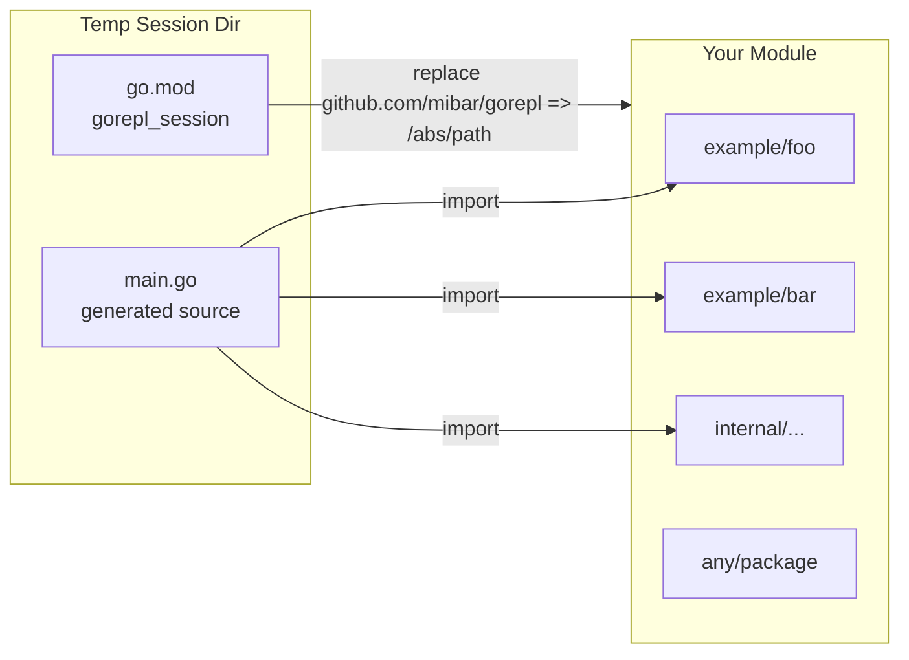
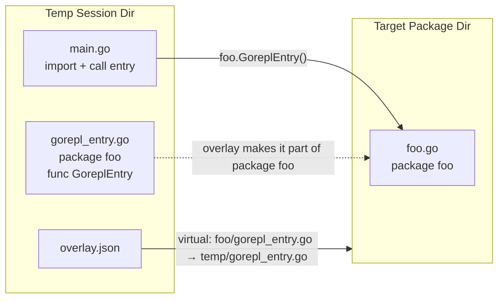
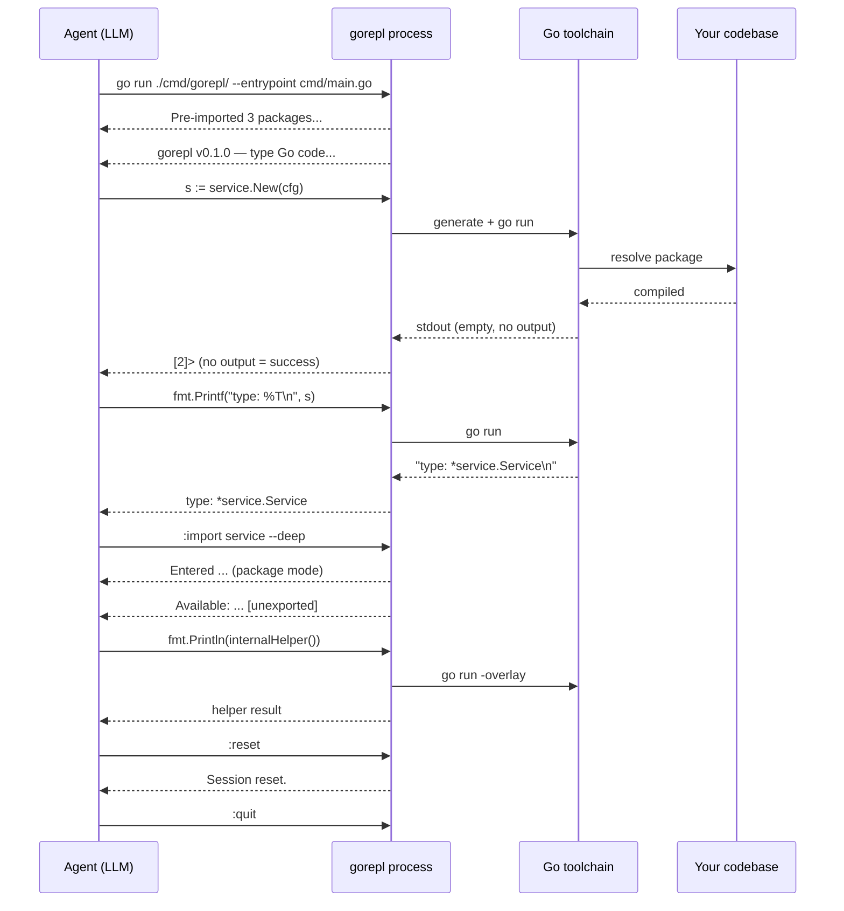
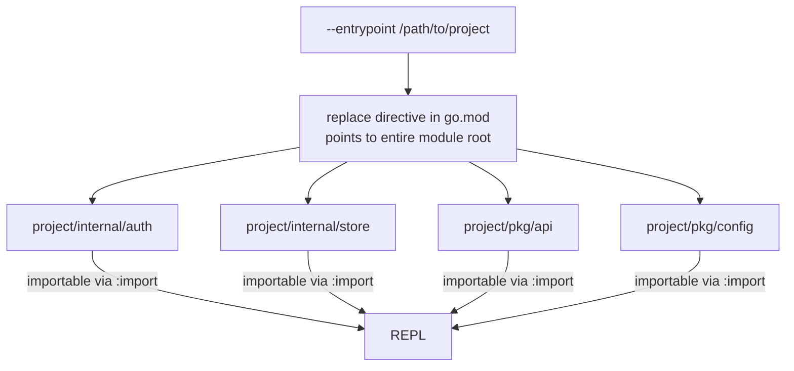

# gorepl

A notebook-style Go REPL for interactive exploration and agentic use.

Code accumulates across cells — each new line is evaluated in the context of everything typed before it, exactly like a Jupyter notebook. This makes it suitable for both human use and automated agents that need to execute Go code against a real codebase.

---

## How it works



The key property: the entire session is a **single growing `main()` function** (or a single `GoreplEntry()` function when in package mode). When you type cell 5, gorepl regenerates the full source from cells 1–5 and re-runs it. Prior cells are context, not re-executed independently — the Go compiler sees one program.

### Temp module architecture

When you pass `--entrypoint <path>`, gorepl sets up a temp module that proxies into your codebase via a `replace` directive:



The generated `go.mod` looks like:

```
module gorepl_session

go 1.25

require github.com/mibar/gorepl v0.0.0

replace github.com/mibar/gorepl v0.0.0 => /Users/you/projects/gorepl
```

Your entire module is accessible — every package in it, transitively. The Go toolchain resolves dependencies normally from there.

---

## Quick start

```bash
# Standalone mode (stdlib only)
go run ./cmd/gorepl/

# Module mode: load a module from its directory (must contain go.mod)
go run ./cmd/gorepl/ --entrypoint /path/to/your/module

# From within the module itself
go run ./cmd/gorepl/ --entrypoint .

# File mode: also pre-imports the file's local dependencies
go run ./cmd/gorepl/ --entrypoint cmd/server/main.go
```

---

## Cell model

Each input is a **cell**. Cells accumulate. The output shown after each cell is only the output *produced by that cell* (not the entire program's cumulative stdout).

```
[1]> x := 42
[2]> fmt.Println(x)
42
[3]> y := x * 2
[4]> fmt.Println(y)
84
[5]> :cells
  [1] (ok) x := 42
  [2] (ok) fmt.Println(x)
  [3] (ok) y := x * 2
  [4] (ok) fmt.Println(y)
```

If a cell fails to compile or run, it is **discarded** and the session rolls back:

```
[5]> fmt.Println(undefined)
[cell 5]: undefined: undefined
[5]>   ← same prompt, cell 5 was not committed
```

Before reporting a failure, gorepl transparently attempts two auto-fixes:

- **Unused imports** — removed from the generated source
- **Unused variables** — suppressed via `_ = varName`

If the fixed version compiles, the cell is committed without any indication. This lets you type exploratory expressions (e.g. `x := someCall()`) without Go's strict unused-variable check blocking you.

Multi-line input is handled automatically. The REPL continues reading until all brackets are balanced:

```
[5]> for i := 0; i < 3; i++ {
...      fmt.Println(i)
...  }
0
1
2
```

---

## Working with your codebase

### The example module

The `example/` directory contains two packages:

```
example/
  foo/foo.go   — package foo, type Foo struct { Do() }
  bar/bar.go   — package bar, type Bar struct { Do() }
```

### `:import` — dot-import (all exports)

When launched with `--entrypoint`, `:import` promotes a module package's exports into the REPL namespace — no prefix needed:

```
[1]> :import foo
Imported github.com/mibar/gorepl/example/foo (dot-import, all exports)
[2]> f := New()
[3]> f.Do()
```

This is equivalent to Go's `import . "pkg"`. Every exported symbol from the package becomes directly available.

### `:import` — selective symbols

Import only the symbols you need with `--symbols`:

```
[1]> :import bar --symbols=New,Bar
Imported from github.com/mibar/gorepl/example/bar (selective)
[2]> b := New()
[3]> fmt.Printf("%T\n", b)
*bar.Bar
```

Under the hood, gorepl generates type aliases and value bindings:

```go
import "github.com/mibar/gorepl/example/bar"

type Bar = bar.Bar
var New = bar.New
```

If two packages export the same symbol name, gorepl errors at import time rather than silently shadowing:

```
[4]> :import foo --symbols=New
error: New already imported from github.com/mibar/gorepl/example/bar — use :reset or qualified foo.New
```

### `:import --ns` — qualified (namespaced) import

Use `--ns` when you want to keep the package namespace:

```
[1]> :import foo --ns
Imported github.com/mibar/gorepl/example/foo (qualified: foo.Symbol)
[2]> f := foo.New()
[3]> f.Do()
```

Combine `--ns` with `--symbols` for qualified selective access:

```
[1]> :import foo --ns --symbols=Foo
Imported github.com/mibar/gorepl/example/foo (qualified: foo.Symbol)
```

### `:import --blank` — side-effect import

For packages that register side effects (database drivers, etc.):

```
[1]> :import github.com/lib/pq --blank
Imported _ "github.com/lib/pq" (side-effect)
```

This emits `import _ "github.com/lib/pq"` in the generated code.

### `:import --deep` — package mode (unexported access)

The `--deep` flag enters **package mode**: your cells run *inside* the target package via Go's `-overlay` mechanism, giving you access to unexported symbols:

```
[1]> :import foo --deep
Entered github.com/mibar/gorepl/example/foo (package mode — unexported access)
Session cleared. Use :reset to exit package mode.
[foo:1]> fmt.Println(secretHelper())
hello from secret
[foo:2]> fmt.Println(defaultName)
default
```

The prompt changes to `[pkg:N]>` to indicate package mode. Use `:reset` to exit back to normal mode.

#### How package mode works



The overlay file is never written to your source tree. Go's `-overlay` flag maps it virtually at build time.

### `:import` — discovery

List what's currently imported:

```
[5]> :import
  . "github.com/mibar/gorepl/example/foo"  (all exports)
    bar "github.com/mibar/gorepl/example/bar"  (qualified)
  _ "github.com/lib/pq"  (side-effect)
    "github.com/mibar/gorepl/example/baz" → New, Baz  (selective)
```

Discover available exports before importing:

```
[6]> :import bar ?
Exports from github.com/mibar/gorepl/example/bar:
  type  Bar
  func  New
```

Discover *all* symbols including unexported (useful before `--deep`):

```
[7]> :import bar ??
All symbols from github.com/mibar/gorepl/example/bar:
  type  Bar
  func  New
  func  helper   [unexported]
  var   internal [unexported]
```

`:reset` clears all imports and exits package mode.

---

## Commands

| Command | Alias | Description |
|---------|-------|-------------|
| `:quit` | `:q` | Exit (auto-saves persistent sessions) |
| `:destroy` | | Remove persistent session and exit |
| `:reset` | `:r` | Clear all cells, imports, exit package mode |
| `:cells` | `:c` | List all cells with status |
| `:remove <id>` | `:rm` | Remove a cell by ID |
| `:state` | | Show current REPL state (cells, imports, mode, env) |
| `:import` | `:i` | List imported packages |
| `:import <pkg>` | `:i` | Dot-import all exports |
| `:import <pkg> --symbols=Foo,New` | | Selective dot-import |
| `:import <pkg> --ns` | | Qualified import (`pkg.Symbol`) |
| `:import <pkg> --ns --symbols=Foo` | | Qualified selective |
| `:import <pkg> --deep` | | Package mode (unexported access) |
| `:import <pkg> --blank` | | Side-effect import (`import _ "pkg"`) |
| `:import <pkg> ?` | | List exported symbols |
| `:import <pkg> ??` | | List all symbols (incl. unexported) |
| `:env` | `:e` | List custom env vars |
| `:env KEY=VALUE` | | Set an env var |
| `:env KEY` | | Show one env var |
| `:dep <pkg>` | `:d` | Add a third-party dependency |
| `:cd <dir>` | | Change working directory |
| `:pwd` | | Print current working directory |
| `:help` | `:h` | Command reference |

### `:env` example

```
[1]> :env DB_URL=postgres://localhost/dev
  DB_URL=postgres://localhost/dev
[2]> :env
  DB_URL=postgres://localhost/dev
[3]> fmt.Println(os.Getenv("DB_URL"))
postgres://localhost/dev
```

### `:dep` example

```
[1]> :dep github.com/google/uuid
Adding github.com/google/uuid...
Added github.com/google/uuid
[2]> :import github.com/google/uuid --ns
Imported github.com/google/uuid (qualified: uuid.Symbol)
[3]> fmt.Println(uuid.New())
550e8400-e29b-41d4-a716-446655440000
```

---

## CLI flags

| Flag | Description |
|------|-------------|
| `--entrypoint <path>` | **Directory** (contains `go.mod`): loads the module, enabling `:import` and `--deep`. **`.go` file**: same, plus auto-imports the file's local dependencies as qualified imports. |
| `--session <name>` | Named persistent session (stored in `~/.gorepl/sessions/<name>`) |
| `--session-dir <path>` | Explicit persistent session directory |
| `--list-sessions` | List saved sessions and exit |

### `--entrypoint` — module access + pre-load

#### Directory mode

```bash
go run ./cmd/gorepl/ --entrypoint .
go run ./cmd/gorepl/ --entrypoint /path/to/project
```

Loads the module and builds a package index. Enables short-name resolution
(`:import config` instead of `:import github.com/you/app/config`) and `--deep`
overlay mode. The directory must contain `go.mod`.

#### File mode

```bash
go run ./cmd/gorepl/ --entrypoint cmd/server/main.go
```

Everything from directory mode, plus BFS import traversal: all local packages
reachable from the file are pre-imported as qualified imports at startup.

```
Pre-imported 4 packages from cmd/server/main.go:
  service              github.com/you/app/internal/service
  store                github.com/you/app/internal/store
  config               github.com/you/app/pkg/config
  auth                 github.com/you/app/internal/auth
gorepl v0.1.0 — type Go code, :help for commands
[1]> cfg := config.Load()
[2]> svc := service.New(cfg)
```

This is particularly useful for agents: point gorepl at your main entry point and all your project's packages are immediately available without any `:import` commands.

The entrypoint also discovers import aliases from the source file — if your code has `import svc "module/service"`, the short name `svc` will be used in the REPL.

---

## Sessions

gorepl supports persistent sessions that survive process restarts. Session state includes all cells, loaded packages, and custom environment variables.

### Named sessions

```bash
# Start (or resume) a named session stored under ~/.gorepl/sessions/
go run ./cmd/gorepl/ --session my-session

# Combine with a module or entrypoint
go run ./cmd/gorepl/ --session my-session --entrypoint /path/to/project
```

`:quit` saves automatically. The next time you start with the same name, cells and imports are restored:

```
$ go run ./cmd/gorepl/ --session my-session
Resumed session (4 cells)
gorepl v0.1.0 — type Go code, :help for commands
[5]>
```

### Explicit session directory

```bash
# Use any directory instead of the default location
go run ./cmd/gorepl/ --session-dir /path/to/session/dir
```

`--session` and `--session-dir` are mutually exclusive.

### Listing sessions

```bash
go run ./cmd/gorepl/ --list-sessions
```

```
NAME                  CELLS  UPDATED               DIR
my-session            4      2025-01-15 10:32:41   /Users/you/.gorepl/sessions/my-session
scratch               1      2025-01-14 09:05:12   /Users/you/.gorepl/sessions/scratch
```

### Destroying a session

Use `:destroy` inside an active session to permanently delete the session directory and exit:

```
[4]> :destroy
Session destroyed.
```

Without `--session` / `--session-dir`, gorepl runs in ephemeral mode: a temp directory is created at startup and cleaned up on exit.

---

## Agentic use

gorepl is designed to be driven by an agent (LLM) that needs to execute and verify Go code interactively. The agent pipes commands into stdin and reads structured output from stdout/stderr.

### Agent interaction model



### What the agent can do

- **Explore types at runtime**: `fmt.Printf("%T %+v\n", val, val)`
- **Test assumptions about behavior**: call real functions with real data, see what comes back
- **Accumulate state**: build up objects across cells, inspect at each step
- **Roll back on error**: failing cells are automatically discarded, session stays consistent
- **Import progressively**: start with specific symbols, expand to full packages as needed
- **Inspect internals**: `--deep` mode for unexported access when debugging
- **Discover symbols**: `?` and `??` queries before importing
- **Inject env vars**: `:env DB_DSN=...` before running code that reads env
- **Add deps mid-session**: `:dep github.com/some/lib` then import and use it

### Import strategy for agents

| Goal | Command |
|------|---------|
| Quick exploration of a package | `:import pkg` (dot-import all) |
| Minimal footprint, avoid collisions | `:import pkg --symbols=Foo,New` |
| Use multiple packages without collision | `:import pkg --ns` |
| Side-effect driver registration | `:import driver/pkg --blank` |
| Debug unexported internals | `:import pkg --deep` |
| See what's available first | `:import pkg ?` or `:import pkg ??` |
| Inspect current session state | `:state` |

### Piped usage (non-interactive agent)

```bash
printf '
:import foo
f := New()
f.Do()
fmt.Printf("type=%%T\n", f)
:quit
' | go run ./cmd/gorepl/ --entrypoint .
```

Output:
```
gorepl v0.1.0 — type Go code, :help for commands
[1]> Imported github.com/mibar/gorepl/example/foo (dot-import, all exports)
Available:
  type  Foo
  func  New
[2]> [3]> [4]> type=*foo.Foo
[5]>
```

The agent parses: lines that match `[N]> <output>` carry cell output; lines with `[cell N]:` are errors.

---

## Does it scale to a whole codebase?

**Short answer: yes, for a single Go module.** `--entrypoint` makes every package in the module importable — not just one entry point, but the entire tree. You import on demand with `:import`.



### Current limitations

| Scenario | Status |
|----------|--------|
| Single module, any package | Works |
| Module with external deps (go.sum) | Works — go.sum is copied to temp dir |
| Entrypoint file mode (`--entrypoint <file>`) | Works — BFS import traversal |
| Unexported access (`--deep` overlay) | Works — one primary package at a time |
| Module compiled from `go.work` workspace | Not supported |
| Multiple local modules | Not supported (one `replace` at a time) |

### Stdlib auto-import

Standard library packages are auto-detected from `pkg.Symbol` patterns in your code. When gorepl sees `fmt.Println`, it automatically adds `import "fmt"` — no `:import` needed for stdlib.
