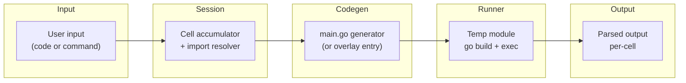
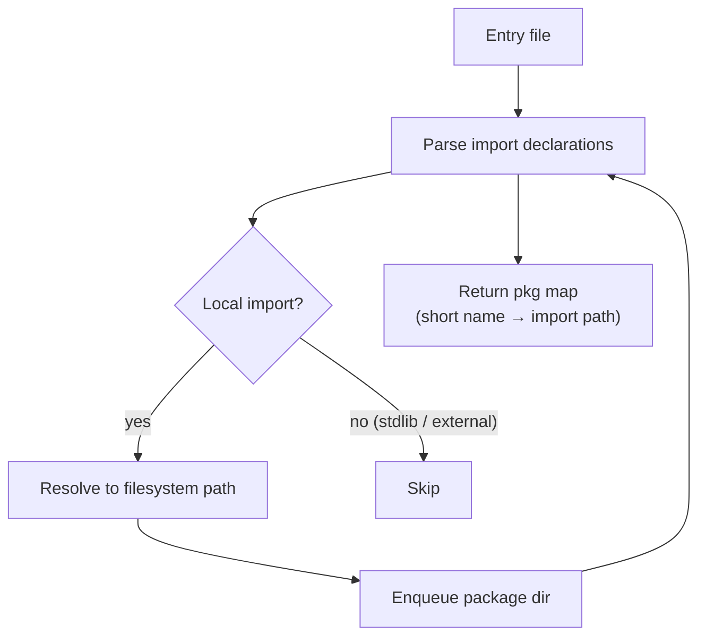

# Architecture

This document describes the high-level architecture of **gorepl** — the major components, how data flows between them, and why each design decision was made.

> **Change-friendly note:** this document describes *roles and responsibilities*, not specific variable names or struct fields. Consult the source for implementation-level detail.

---

## Overview

gorepl is a **notebook-style Go REPL**. It accumulates code cells into a single growing `main()` function, generates a complete Go program, compiles and runs it on every evaluation, and streams back the output. This design trades execution speed for simplicity — no interpreter, no partial compilation, just standard `go build`.

---

## Pipeline

Each evaluation follows a **four-stage pipeline**:

---

## Stage 1 — Input (repl)

**Input:** raw bytes from stdin or an interactive terminal.
**Output:** a dispatched command or a new code cell.

The REPL loop reads lines and tracks **bracket depth** to support multi-line input — an expression is not submitted until all `{`, `(`, and `[` are balanced. Commands starting with `:` are dispatched immediately; everything else is accumulated into the session.

**Key properties:**
- Bracket-depth tracking prevents premature submission of incomplete blocks.
- Command dispatch is synchronous; code cells go through the full pipeline.
- On EOF, the session is auto-saved if a named session is active.

---

## Stage 2 — Session

**Input:** a new cell (code string) or a command.
**Output:** an updated cell list, import map, and package state.

The session maintains the **full history of accepted cells**. Each cell has an ID, source code, execution status, and output. The session also tracks which packages are loaded (dot-imports, qualified imports, selective symbol imports) and whether the REPL is in package mode.

Import resolution happens here: when the user writes `fmt.Println`, the session maps `fmt` to `"fmt"` (stdlib) or to a local package path (if an entrypoint was loaded).

**Key properties:**
- Thread-safe via `sync.Mutex` — safe for concurrent command dispatch.
- Snapshot/restore enables persistent sessions across processes.
- Package mode (`--deep`) switches the session to emit a package file instead of `main()`.

---

## Stage 3 — Codegen

**Input:** cell list + import map.
**Output:** a complete Go source file.

The code generator stitches all accepted cells into a single `main()` function, separating each cell's output with a delimiter (`\x00__GOREPL__\x00`) so the runner can attribute output back to each cell.

Imports are resolved from the import map and emitted at the top of the file. The generator handles all import modes:

| Mode | Emitted form | Use case |
|------|--------------|----------|
| Dot | `import . "pkg"` | Unqualified access |
| Qualified | `import "pkg"` | Standard qualified access |
| Selective | `import "pkg"` + type alias / var binding | Named symbol extraction |
| Blank | `import _ "pkg"` | Side-effect only |

In package mode, the generator emits a standalone package file with a `GoreplEntry()` function instead of `main()`. The runner invokes it via `go run -overlay`.

**Key properties:**
- Pure function: same inputs always produce the same output.
- No knowledge of the filesystem — only strings in, string out.
- The delimiter enables per-cell output attribution without shell tricks.

---

## Stage 4 — Runner

**Input:** generated Go source.
**Output:** per-cell output strings (or an error).

The runner manages a **temporary module** — a directory with its own `go.mod` that carries a `replace` directive pointing to the entrypoint module (if any). Each evaluation writes the generated source into this temp module and invokes `go build` followed by the compiled binary (or `go run -overlay` in package mode).

Auto-fix passes run between compilation attempts:
- **Unused imports**: detected from compiler errors, removed from the source, retried.
- **Unused variables**: detected from compiler errors, suppressed with `_ = varName`, retried.

**Key properties:**
- The temp module is created once per session and reused across evaluations.
- Timeout (default 30 s) prevents runaway goroutines from blocking the REPL.
- Environment variables are isolated: `SetEnv()` / `RestoreEnv()` for reproducible evaluation.

---

## Module Discovery

When launched with `--entrypoint`, gorepl discovers local packages via **BFS over reachable imports**:

Explicit import aliases in the entry file take priority over the declared package name. The BFS is best-effort: unreadable directories are silently skipped.

---

## Persistence

Sessions are saved as **JSON snapshots** — a serialized list of cells plus metadata. Named sessions persist in a configurable directory (default: `~/.gorepl/sessions/`). On resume, the snapshot is loaded, all cells are replayed through codegen, and the runner's temp module is reconstructed.

---

## Design Decisions

### Why compile-and-run instead of an interpreter?

Correctness over performance. A real `go build` gives you full type checking, the complete standard library, and exact Go semantics — no divergence between REPL and production behaviour. Startup latency per cell is ~200–400 ms, which is acceptable for interactive exploration.

### Why a single growing `main()`?

Simplicity. The alternative — incremental compilation with symbol extraction — requires tracking type definitions, variable scopes, and redeclarations across cells. A single `main()` offloads all of that to the Go compiler, which already handles it correctly.

### Why a `replace` directive instead of vendoring?

The temp module needs to import local packages from the entrypoint module without publishing them. A `replace` directive in the temp `go.mod` achieves this with zero copying and no publish step.

### Why `go run -overlay` for package mode?

The `-overlay` flag lets gorepl inject a generated entry file into an existing package without modifying any source files on disk. This is the least invasive way to call into an arbitrary package during interactive exploration.

---

## Component Map

| Component | Role |
|-----------|------|
| **repl** | Input loop, bracket balancing, command dispatch |
| **session** | Cell history, import state, package mode |
| **codegen** | Generate `main.go` or package overlay from cell list |
| **runner** | Temp module management, `go build` + exec, auto-fix |
| **entrypoint** | BFS import traversal, stdlib map, local pkg discovery |
| **persistence** | JSON session snapshots, save/load lifecycle |
